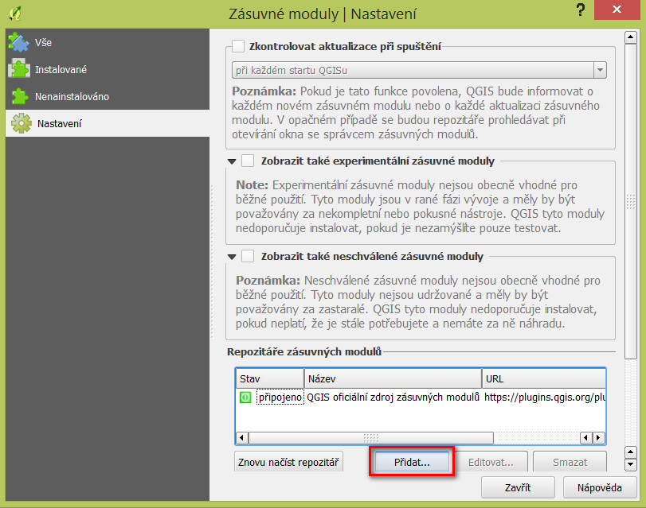
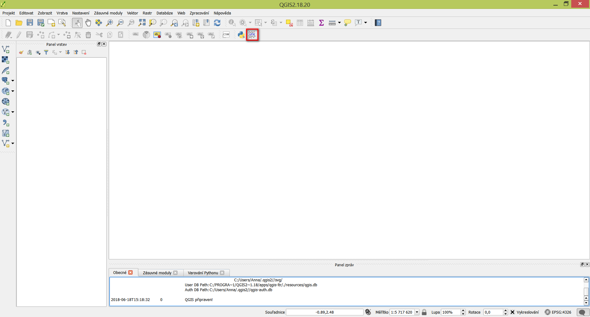

Instalace
---------

Nejprve je nutné v QGISu registrovat repositář laboratoře GeoForAll
ČVUT v Praze: http://geo.fsv.cvut.cz/geoforall/qgis-plugins.xml

.. image:: images/ctu-geoforall-repo.png
   :width: 350

Poté vyberte *VFK Plugin* a klikněte na tlačítko
``Instalovat zásuvný modul``.

.. image:: images/install.png
           
Po instalaci se v nástrojové liště objeví nová ikona:

